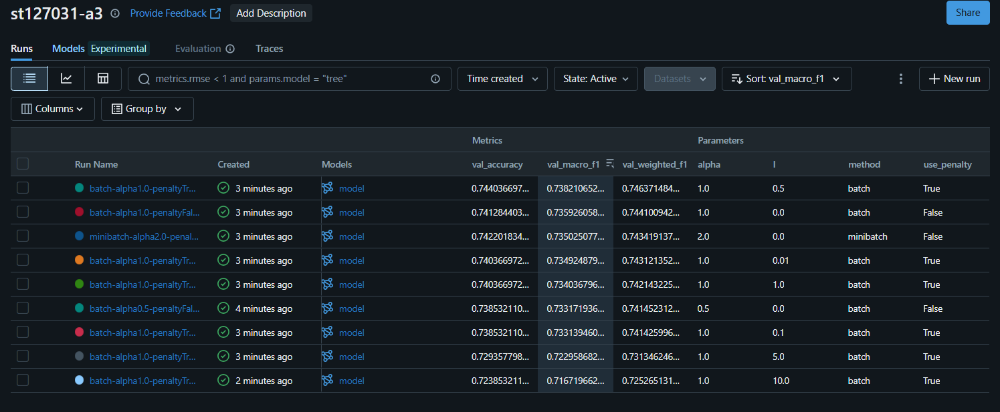
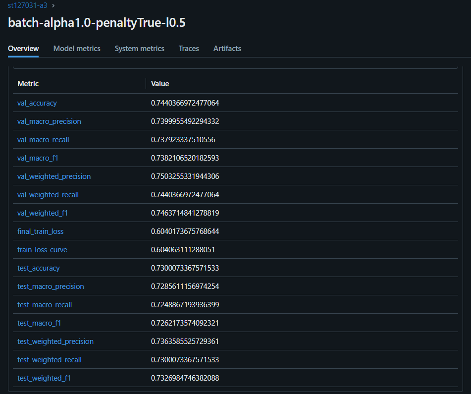
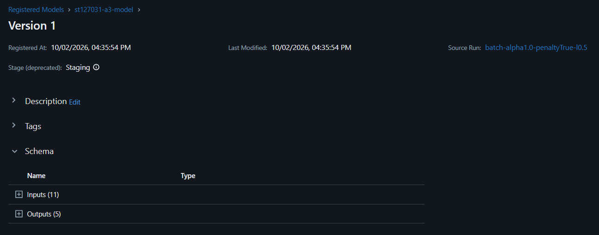

# A3: Predicting Car Price (Classification)

AT82.03 Machine Learning, Assignment 3.

This continues A1 and A2 with the same used car dataset, but now as a
4 class classification problem. `selling_price` is split into 4 price
bands, and a multinomial Logistic Regression written from scratch
(softmax, cross entropy loss, gradient descent, optional Ridge penalty)
predicts which band a car belongs to.

**Live site**: [http://ml.brain.cs.ait.ac.th:8031](http://ml.brain.cs.ait.ac.th:8031) (reachable from inside CSIM)

## Repository contents

```
.
├── README.md
├── car_price_classification_A3.ipynb   # Task 1, 2 and 3 (MLflow)
├── data/
│   └── Cars.csv                         # raw Car Price dataset (same as A1/A2)
├── result/                               # MLflow screenshots
└── app/                                  # web application (Task 3)
    ├── Dockerfile
    ├── docker-compose.yaml               # app + updater (pulls new images on the server)
    ├── tests/
    │   └── test_model.py                 # unit tests (Task 3, Objective 3)
    └── code/
        ├── app.py                        # entry point, nav bar, page routing
        ├── model_inference.py            # predict() used by the app and the tests
        ├── requirements.txt
        ├── assets/
        │   └── style.css
        ├── pages/
        │   ├── home.py                   # compares the A1, A2 and A3 models
        │   ├── old_model.py              # /old: A1 model (from A2, unchanged)
        │   ├── new_model.py              # /new: A2 model (from A2, unchanged)
        │   └── predict.py                # /predict: A3 classifier
        └── model/
            ├── car_price_classifier.pkl  # A3: W + prep (ColumnTransformer) + metadata
            ├── car_price_model.pkl       # A1: scikit-learn pipeline
            ├── car_price_model_v2.pkl    # A2: theta + prep + residual std
            └── model_metadata.pkl        # A1/A2: owner scale and column lists
```

## Task 1: Classification

* `selling_price` is split into 4 classes (**Budget, Mid-range, Premium,
  Luxury**) with `pd.qcut`. The bin edges come from the training set
  only, so each class has about 25% of the cars.
* `LogisticRegression` is based on `02 - Multinomial Logistic
  Regression.ipynb` (softmax, cross entropy, batch / minibatch /
  stochastic gradient descent). I divide the gradient by the batch size
  `m`, because without it the gradient was too large on our 4,360 training
  rows (Section 3.1 of the notebook explains this).
* The metrics are **methods of the `LogisticRegression` class**:
  `accuracy`, `precision`, `recall`, `f1_score` (per class), `macro_*`,
  `weighted_*` and `classification_report`. They do not use
  `sklearn.metrics`. On imbalanced mock data they give exactly the same
  numbers as `sklearn.metrics.classification_report`.
* **What does `support` mean?** It is the number of true samples of each
  class. It does not depend on the predictions, and it is the weight used
  in `weighted avg`.
* The weights in the weighted average already add up to 1, so I do not
  divide by 4 again (the PDF formula shows a division by 4). This follows
  the sklearn definition, so the results can be compared directly.

Preprocessing is the same as A1/A2: the units are removed from
`mileage`, `engine` and `max_power`, `brand` is taken from `name`,
`owner` is an ordered number, missing values
are filled with `SimpleImputer` fitted on the training set, and only
Diesel/Petrol cars are kept (CNG/LPG are about 1% of the data and use a
different mileage unit). One difference from A2: the 5 Test Drive Car
rows are kept (A2 removed them). They are about 0.07% of the data, so
they have almost no effect on the results.

Brands with at least 20 cars in the training set keep their name, and
every other brand becomes `"Other"`, including brands that never appear
in the training set. This list of common brands is saved with the model,
so the web app groups brands the same way (it also ignores upper/lower
case, so "maruti" works like "Maruti").

### Avoiding data leakage

* **Duplicates are removed before splitting.** The raw data has 1,220
  repeated listings. Before this fix, about 20% of the test set had an
  exact copy in the training set, which made the test score too high.
  After removing them, the overlap is 0 (checked in the notebook).
* **Train / validation / test = 64 / 16 / 20.** Brand grouping, class
  edges, imputers and the scaler are fitted on the training set only.
* **Models are compared on the validation set.** This includes no penalty
  vs ridge and all the MLflow runs. The best run is chosen by validation
  `macro_f1`.
* **The test set is used once**, on the model that was already chosen.

| Best model (batch GD, alpha = 1.0, ridge l = 0.5) | Validation | Test |
|---|---|---|
| Accuracy | 0.744 | 0.730 |
| Macro F1 | 0.738 | 0.726 |
| Weighted F1 | 0.746 | 0.733 |

## Task 2: Ridge Logistic Regression

$$ J(\theta) = -\sum_{i=1}^m y^{(i)}\log(h^{(i)}) + \lambda\sum_{j=1}^n \theta_j^2 $$

`RidgePenalty` is adapted from `03 - Bias-Variance Tradeoff and
Regularization.ipynb`. It is applied to the weight matrix of the model
(the bias row is not penalized). Turn it on with
`LogisticRegression(..., use_penalty=True, l=<lambda>)`.

Results on the validation set (batch gradient descent, alpha = 1.0):

| lambda | none | 0.01 | 0.1 | 0.5 | 1 | 5 | 10 |
|---|---|---|---|---|---|---|---|
| Macro F1 | 0.736 | 0.735 | 0.733 | **0.738** | 0.734 | 0.723 | 0.717 |

A small or medium lambda gives about the same score as no penalty. The
best run used lambda = 0.5, but the gap to no penalty is only 0.002, so
ridge does not clearly help on this data. A strong penalty (5 or 10)
makes the score worse because the weights are pushed too close to zero.

## Task 3: Deployment

> **Note about the course MLflow server.** The TA announced (21 Sep and
> 1 Oct 2026) that the course MLflow server
> (`mlflow.ml.brain.cs.ait.ac.th`) was down, so logging and registering
> on it (Objectives 1 and 2) are no longer required. I logged the
> experiments to a **local MLflow instance** (`sqlite:///mlflow_fallback.db`,
> like in A2) and the screenshots below are submitted instead. The
> notebook still tries the course server first and only uses the local
> store if it cannot connect.

### 1. MLflow experiment logging

Experiment `st127031-a3` has 9 runs: no penalty with two learning rates
and minibatch, and ridge with lambda from 0.01 to 10. Each run logs its params, **validation** metrics and
the model. The dataset is not logged. The runs are sorted by
`val_macro_f1`, and the best one is `batch-alpha1.0-penaltyTrue-l0.5`.



The best run also has the `test_*` metrics, which were computed only once
(test accuracy 0.730, test macro F1 0.726):



### 2. Model registry

The best run (by validation `macro_f1`) is registered as
`st127031-a3-model` (version 1) and moved to **Staging**. Section 7 of the
notebook does this with `MlflowClient`. In the MLflow UI it is: open the
run, Register Model, then in the Models tab change the stage to Staging.



The model is saved as a small MLflow pyfunc that only contains `prep`
(the fitted `ColumnTransformer`) and `W` (the weight matrix), not the
`LogisticRegression` object. The web app loads the same two objects
(`app/code/model_inference.py`), so it does not need the notebook's class.

### 3. CI/CD

* `app/tests/test_model.py` has the two unit tests, run with `pytest`:
  1. `test_model_accepts_expected_input`: the model accepts input with
     the expected columns (also with missing values and an unknown
     brand), and raises an error when a required column is missing.
  2. `test_model_output_shape`: the predictions have shape `(m,)` with
     values in 0 to 3, and the probabilities have shape `(m, 4)` with each
     row adding up to 1.
* `.github/workflows/ci-cd.yml` runs the tests on every push. If they
  pass, a second job (only on a push to `main`) builds the Docker image
  and pushes it to Docker Hub (`naweep/car-price-classifier:latest`).
  It needs the repository secrets `DOCKERHUB_USERNAME` and
  `DOCKERHUB_TOKEN`. If they are not set, the job is skipped with a
  notice instead of failing.
* **How the new version reaches the server.** `ml-brain` can only be
  reached from inside CSIM (or through the `bazooka` jump host), so
  GitHub's runners cannot SSH into it. The server pulls instead.
  `app/docker-compose.yaml` has a second service, `updater`, a small
  `docker:27-cli` container that every 5 minutes runs `docker compose pull`
  and `docker compose up -d` for the app. Compose only recreates the app
  when the image has changed. Since the image is pushed only after the
  tests pass, a commit that fails the tests never reaches the live site.
  (The server has no cron, so the loop runs in a container with
  `restart: unless-stopped`, which also comes back after a reboot.)

  ```
  git push -> GitHub Actions: pytest -> build + push image -> Docker Hub
                                                                 |
  ml-brain, updater container (every 5 min): pull && up -d  <----+
  ```

  The workflow can also SSH into the server and restart the app right
  away if `SSH_HOST`, `SSH_USER`, `SSH_KEY` (and `SSH_PROXY_HOST` for
  the jump host) are set. I did not set these, so deployment goes
  through the updater.

## How to run

**Notebook**
```bash
pip install -r app/code/requirements.txt jupyter matplotlib seaborn
jupyter notebook car_price_classification_A3.ipynb
```

**Web app (local)**
```bash
cd app/code
pip install -r requirements.txt
python app.py
```
Then open `http://localhost:8050`.

The website keeps the A1 and A2 models and adds the A3 classifier:

| Page | Model | Output |
|---|---|---|
| `/` | | compares the three models and shows the A3 price classes |
| `/old` | A1 scikit-learn pipeline | a price |
| `/new` | A2 linear regression from scratch | a price and a ~90% range |
| `/predict` | **A3 logistic regression from scratch** | a price class and the probability of each class |

**Web app (Docker)**
```bash
cd app
docker build -t car-price-classifier .
docker run -p 8050:8050 car-price-classifier
```

The app uses the model file saved by the notebook
(`app/code/model/car_price_classifier.pkl`). Because the course MLflow
server is not stable, loading from the registry
(`models:/st127031-a3-model/Staging`) is optional: set
`USE_MLFLOW_REGISTRY=1`. It waits at most 5 seconds and uses the local
file if the registry does not answer, so the website still starts.

**Tests**
```bash
pip install -r app/code/requirements.txt
pytest app/tests/ -v
```

### Deployment

The `ml-brain` server no longer runs Traefik (the `web` network from A2
is gone), so like the other A3 deployments the app is published on its
own port: **http://ml.brain.cs.ait.ac.th:8031** (inside CSIM).

Set up once on `ml-brain` (from inside CSIM). The server cannot reach
GitHub, so the compose file is created on the server with the same
content as `app/docker-compose.yaml`:

```bash
ssh st127031@ml.brain.cs.ait.ac.th
mkdir -p ~/a3-car-price && cd ~/a3-car-price
nano docker-compose.yaml      # paste app/docker-compose.yaml
docker compose up -d          # starts the app and the updater
docker compose ps
```

After that every push to `main` that passes the tests is live within
about 5 minutes, with no manual step. The folder must be named
`a3-car-price`, because the updater uses that as the compose project name.